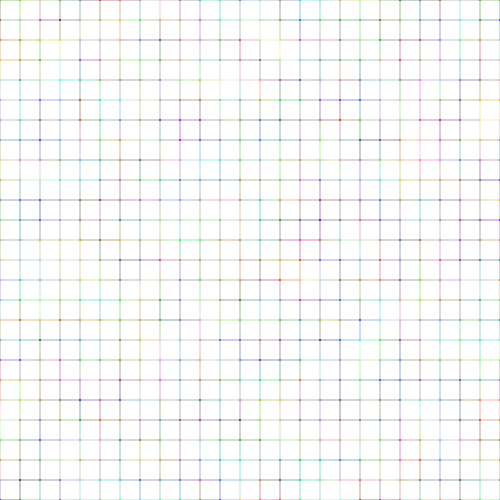
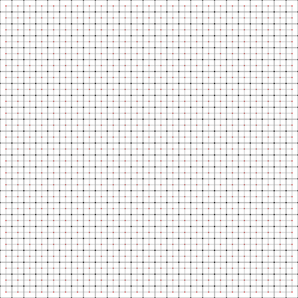
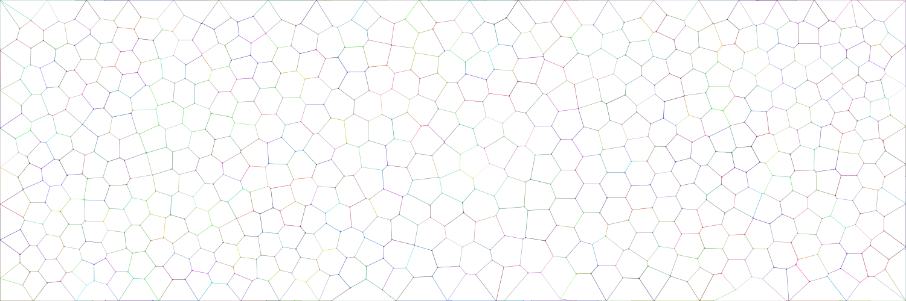
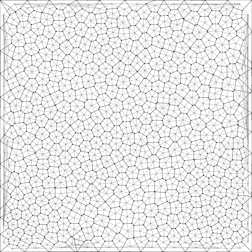
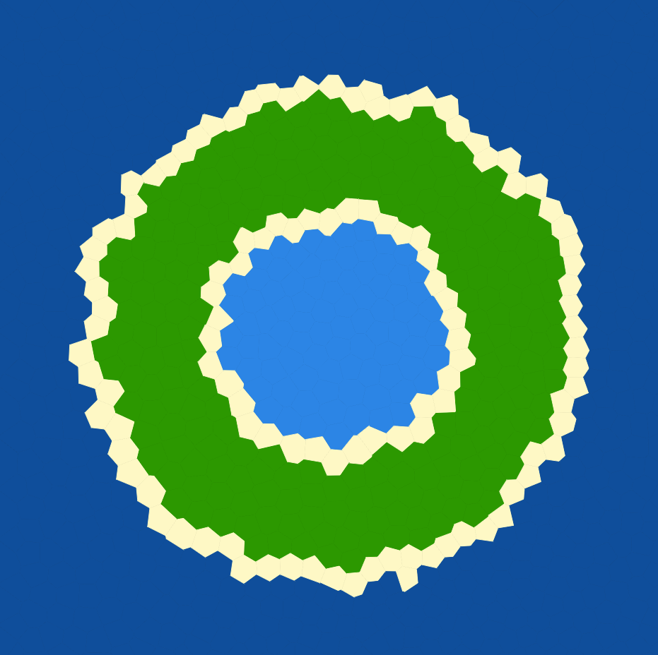

# Assignment A2: Mesh Generator
  - Mithun Paramathasan [paramatm@mcmaster.ca]
  - Nirmal Chaudhari [chaudn12@mcmaster.ca]
  - Sathurshan Arulmohan [arulmohs@mcmaster.ca]


## How to run the product

### Installation instructions

This product is handled by Maven, as a multi-module project. 

To install the different tooling on your computer, simply run:

```
mvn install
```

After installation, you'll find an application named `generator.jar` in the `generator` directory, and a file named `visualizer.jar` in the `visualizer` one. 

### Generator

To run the generator, go to the `generator` directory, and use `java -jar` to run the product. Sample.mesh is the binary file containing the mesh.

#### Grid-Based Mesh
```
cd generator 
java -jar generator.jar sample.mesh -grid [-width] [-height] [-spacing]
ls -lh sample.mesh
```
`width` and `height` default is 500px while `spacing` default is 20 and are optional to change in the command line. Note that the minimum spacing is 10. 

Example: `java -jar generator.jar sample.mesh -grid -width 400 -height 400`

#### Irregular Mesh
```
cd generator 
java -jar generator.jar sample.mesh -irregular -numPoly [-width] [-height] [-relation]
ls -lh sample.mesh
```
`numPoly` is the number of polygons to generate on the mesh.\
`width` and `height` default is 500px and are optional to change in the command line. \
`relation` default is 1 and value can be changed for any values greater than 1 to smooth the mesh.

Example: `java -jar generator.jar sample.mesh -irregular -numPoly 500 -width 600 -height 600 -relation 3`

### Island
Generates a map based on input mesh and command line arguments. 

#### Sandbox 
To run sandbox mode of the island generator, go to the `island` directory, and use `java -jar` to run the product. Use the mesh created by the generator as input mesh and enter .mesh file name to save the island generated map.  

```
cd island
java -jar island.jar -input (input.mesh) -output (output.mesh) --mode sandbox
```
The output.mesh will be stored in the directory `island` by default.

Example: `java -jar island.jar -i ../generator/sample.mesh -o sandbox.mesh --mode sandbox`

### Visualizer

To visualize an existing mesh, go the the `visualizer` directory, and use `java -jar` to run the product. The product takes in the file containing the mesh, and the name of the file to store the visualization (as an SVG image).

```
cd visualizer 
java -jar visualizer.jar ../generator/sample.mesh sample.svg [-X]
ls -lh sample.svg
```
To viualize the SVG file:

  - Open it with a web browser
  - Convert it into something else with tool slike `rsvg-convert`

### Debug Visualizer
In debug mode, it will visualize the polygon's segments and vertices as black, centroid as red and neighbouring relations as grey. Debug mode uses the flag `-X`
 ```
 java -jar visualizer.jar ../generator/sample.mesh sample.svg -X
 ```

### Example runs
To see a examples of the mesh, run any one of the scripts below in the main directory. The mesh will be saved as ../generator/sample.mesh.

```./runAll```



```./runAllDebug```



```./runAllIrregular```



```./runAllDebugIrregular```



```./runSandbox```




## How to contribute to the project

When you develop features and enrich the product, remember that you have first to `package` (as in `mvn package`) it so that the `jar` file is re-generated by maven.

## Backlog

### Definition of Done
A feature is determined as done if it succesfully accomplishes the minimum of the feature without affecting previous features implemented. It shoul not introduce no more than 30 minutes of technical debt. 

status:
Pending (P), Started (S), Blocked (B), Done (D)


### Product Backlog

| Id | Feature title | Who? | Start | End | Status |
|:--:|---------------|------|-------|-----|--------|
| F01   |  Create a Mesh with a determined width and height |   Sathurshan   |   02/08/2023    |  02/08/2023   |   D     |
| F02   |  Generate all Vertices for each polygons |  Nirmal    |    02/09/2023   |  02/09/2023   |    D    |
| F03   |  Generate polygons on mesh |  Nirmal    |    02/10/2023   |  02/10/2023   |   D     |
| F04   |  Generate segments on polygon |  Nirmal    |   02/09/2023    |  02/09/2023   |   D     |
| F05   |  Verticies colours have transparency attributes |   Sathurshan   |   02/09/2023    |  02/09/2023   |   D     |
| F06   |  Segment colours have transparency attributes |   Mithun   |   2/10/2023    |  2/10/2023   |    D    |
| F07   |  Show vertices with different thickness |  Sathurshan    |   02/09/2023    |   02/09/2023  |    D    |
| F08   |  Show segments with different thickness |  Mithun    |   2/10/2023    |  2/10/2023  |    D    |
| F09   |  Show segments with calculated colours |   Mithun   |  2/10/2023  |  2/10/2023  |    D    |
| F10   |  Generate centroid vertex of the polygons |  Sathurshan    |  02/09/2023     |   02/09/2023  |  D      |
| F11   |  Generate neighbouring relations of the polygons |  Nirmal    |   02/12/2023    |  02/12/2023   |    D    |
| F12   |  Provide debug mode |   Sathurshan   |   02/08/2023    |  02/08/2023   |    D    |
| F13   |  debug mode: polygon in black |  Sathurshan    |   02/11/2023    |  02/11/2023   |     D   |
| F14   |  debug mode: centroid in red |  Sathurshan    |  02/11/2023     |  02/11/2023   |    D    |
| F15   |  debug mode: neighbourhood relations in light grey |  Mithun    |  02/20/2023     | 02/25/2023    |  D      |
| F16   |  Crop mesh to expected size |   Nirmal   |    02/15/2023   |  02/17/2023   |    D    |
| F17   |  Polygons randomly placed on meshed |  Nirmal   |   02/15/2023    |  02/15/2023   |    D    |
| F18   |  Generate irregular polygons |  Nirmal  |    02/15/2023   |  02/15/2023   |    D    |
| F19   |  Determine neighbourhood relationships using delaunay triangulation | Mithun   |   02/18/2023    |  02/21/2023   |    D    |
| F20   |  Generate neighbouring segments for each polygon | Mithun   |   02/18/2023    |  02/21/2023   |    D    |
| F21   |  Choose type of mesh from command line | Sathurshan   |   02/15/2023    |  02/15/2023   |    D    |
| F22   |  Choose number of polygons from command line |  Sathurshan  |   02/15/2023    |   02/15/2023  |   D     |
| F23   |  Choose relaxation level from command line | Sathurshan   |  02/17/2023     |   02/17/2023  |    D    |
| F24   |  Choose width and height from command line | Sathurshan   |   02/15/2023    |  02/15/2023   |    D    |
| F25   |  Command line have -h (help) option |  Sathurshan  |   02/15/2023    |  02/15/2023   |    D    |
| F26   |  Choose grid box size for gird base mesh from command line |  Sathurshan  |   02/21/2023    |  02/21/2023   |    D    |
| F27   | User can enter map mode with -- mode via command line      | Mithun     |  |  | P  |
| F28   | –help mode in the command line gives a description of how to use to command line  | Mithun |  |  | B(F27),B(F32),B(F38),B(F45),B(F46),B(F50),B(F52),B(F59),B(F83)|
| F29   | Sandbox map mode can be activated  | Sathurshan     | 03/05/2023 | 03/05/2023 | D |
| F30   | Regular map mode can be activated  | Sathurshan     | 03/06/2023 | 03/06/2023 | D |
| F31   | Heat map mode can be activated     | Nirmal     | 03/15/2023 | 03/15/2023 | D  |
| F32   | User can enter the shape of the island with -- shape via command line  | Sathurshan     | 03/05/2023 | 03/05/2023 | D   |
| F33   | Islands have oval shape option   | Sathurshan | 03/13/2023 | 03/13/2023 | D  |
| F34   | Islands have irregular shape option  | Sathurshan | 03/14/2023  | 03/14/2023 | D |
| F35   | Islands have circular shape option      | Sathurshan | 03/05/2023 | 03/05/2023 | D |
| F36   | Islands have a rectangle shape option   | Sathurshan | 03/06/2023 | 03/06/2023 | D |
| F37   | Islands have a ring shape option  | Sathurshan |  |  | B(F32) |
| F38   | User can enter general elevation trend using  --altitude through the command prompt | Nirmal     | 03/06/2023 | 03/06/2023 | D |
| F39   | Island altitude has “volcanic” option   | Nirmal     | 03/06/2023 | 03/06/2023 | D   |
| F40   | Island altitude has “hill” option  | Nirmal     |  |  | B(F38)  |
| F41   | Island altitude has “flat” option  | Nirmal     |  |  | B(F38)  |
| F42   | Island altitude has “random” option  | Nirmal     |  |  | B(F38)   |
| F43   | Enter Debug Elevation mode from command line using -XE  | Nirmal     | 03/08/2023 | 03/08/2023 | D   |
| F44   | Each vertex has an associated temperature  | Nirmal     | 03/15/2023 | 03/15/2023 | D        |
| F45   | Every polygon has an average temperature    | Nirmal     | 03/15/2023 | 03/15/2023 | D   |
| F46   | User can enter the maximum number of lakes on the island using —lakes via the command line.   | Mithun     | 03/21/2023  | 03/21/2023  | D  |
| F47   | User can enter the maximum number of rivers on the island using –rivers via the command line. | Sathurshan | 03/15/2023 | 03/15/2023 | D   |
| F48   | Generate rivers on the island    | Sathurshan | 03/15/2023 | 03/15/2023 | D  |
| F49   | Generate endorheic lakes   | Sathurshan | 03/15/2023 | 03/15/2023 | D   |
| F50   | Merge rivers that intersect with each other | Sathurshan | 03/15/2023 | 03/15/2023 | D |
| F51   | User can enter the number of aquifers on the island using —aquifers via the command line.     | Mithun     | 03/21/2023 | 03/21/2023 | D  |
| F52   | Generate aquifers on the island | Mithun     | 03/21/2023 | 03/21/2023 | S   |
| F53   | User can enter soil absorption profile —soil via the command line.   | Nirmal     | 03/18/2023 | 03/18/2023 | D   |
| F54   | Wet soil profile applied to map  | Nirmal     | 03/18/2023 | 03/18/2023 | D     |
| F55   | Humid soil profile applied to map  | Nirmal     | 03/20/2023 | 03/20/2023 | D    |
| F56   | Dry soil profile applied to map     | Nirmal     | 03/20/2023 | 03/20/2023 | D         |
| F57   | Each land segment has a particular soil absorption.     | Nirmal     | 03/18/2023 | 03/18/2023 | D      |
| F58   | Each land segment has particular humidity.   | Nirmal     | 03/20/2023 | 03/20/2023 | D     |
| F59   | Humidity affects color brightness or darkness   | Nirmal     | 03/20/2023 | 03/20/2023 | D   |
| F60   | User can enter the biome type of the island using -–biomes via the command line.   | Mithun     |  |  | P |
| F61   | Arctic type map generatable  | Sathurshan     | 03/21/2023 | 03/21/2023 | D  |
| F62   | Tropical Rain Forest type map generatable    | Mithun     |  |  | B(F59)   |
| F63   | Temperate deciduous forest type map generatable  | Mithun     |  |  | B(F59)  |
| F64   | Desert type map generable   | Mithun     |  |  | B(F59)     |
| F65   | All tiles have assigned types for Sandbox     | Sathurshan | 03/06/2023 | 03/06/2023 | D  |
| F66   | All land tiles have assigned biomes in relation to island biomes type  | Sathurshan |  |  | B(F60-F63),  B(F43), B(F57)   |
| F67   | Display ocean tiles   | Sathurshan | 03/06/2023 | 03/06/2023 | D  |
| F68   | Display beach tiles   | Sathurshan | 03/06/2023 | 03/06/2023 | D  |
| F69   | Display lake tiles  | Mithun     | 03/21/2023 | 03/21/2023 | D   |
| F70   | Display lagoon tiles  | Sathurshan     | 03/06/2023 | 03/06/2023 | D    |
| F71   | Display ice tiles   | Sathurshan | 03/21/2023 | 03/21/2023 | D   |
| F72   | Display snow tiles    | Sathurshan | 03/21/2023 | 03/21/2023 | D    |
| F73   | Display tundra tiles      | Sathurshan | 03/21/2023  | 03/21/2023 | D     |
| F74   | Display taiga tiles     | Sathurshan | 03/21/2023  | 03/21/2023  | D  |
| F75   | Display forest tiles     | Nirmal     |  |  | B(F65)    |
| F76   | Display jungle tiles    | Nirmal     |  |  | B(F65)   |
| F77   | Display swamp tiles    | Nirmal     |  |  | B(F65)   |
| F78   | Display grassland tiles     | Sathurshan   | 03/06/2023  | 03/06/2023 | D   |
| F79   | Display sandy desert tiles    | Nirmal     |  |  | B(F65)    |
| F80   | Display savanna tiles      | Mithun     |  |  | B(F65)   |
| F81   | Display clay tiles    | Mithun     |  |  | B(F65)      |
| F82   | Output default seed     | Sathurshan | 03/08/2023 | 03/08/2023 | D   |
| F83   | Output all the user’s input parameters   | Mithun     |  |  | B(F27),B(F28),B(F32),B(F38),B(F45),B(F46),B(F50),B(F52),B(F59),B(F83) |
| F84   | User can enter the seed to use via -–seed via the command line    | Sathurshan | 03/12/2023 | 03/12/2023 | D   |
| F85   | Generate same seed map     | Sathurshan | 03/12/2023 | 03/12/2023 | D   |
| F86   | Goods for each tile depending on tile conditions  | Mithun     |  |  | B(F57),B(F43)  |
| F87   | Islands have random shape option  | Sathurshan     | 03/13/2023 | 03/14/2023 | D  |