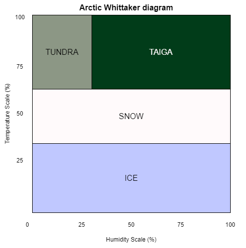
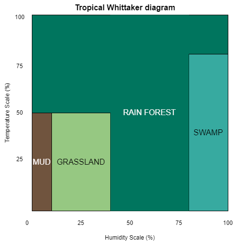
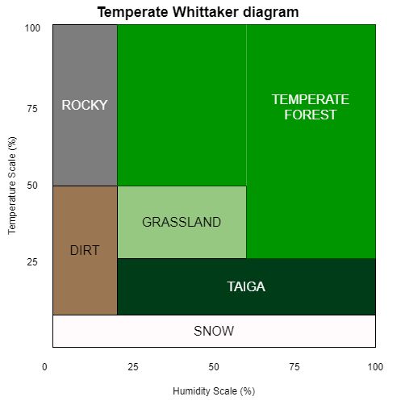
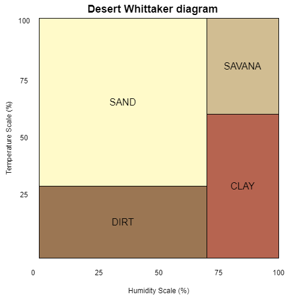
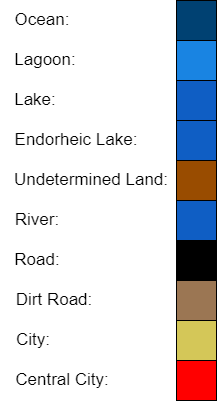
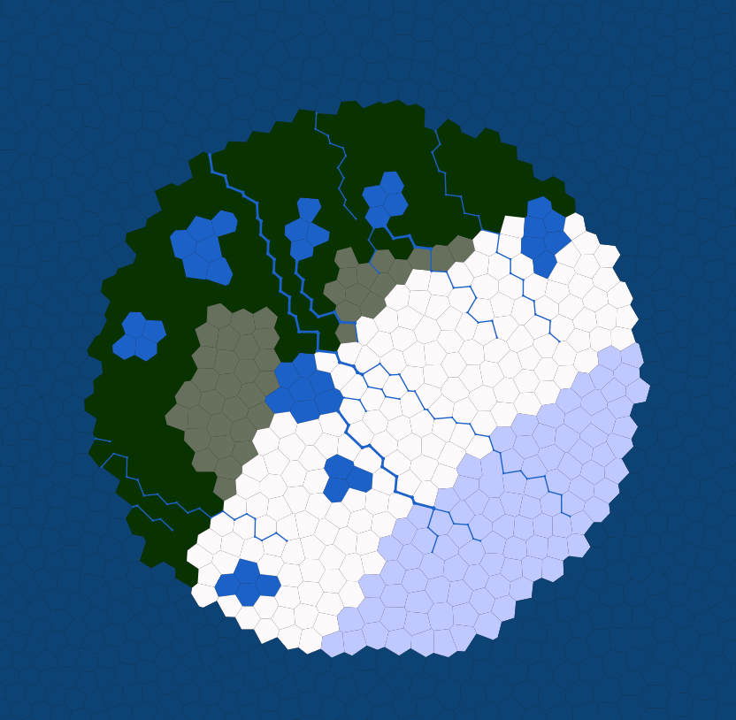
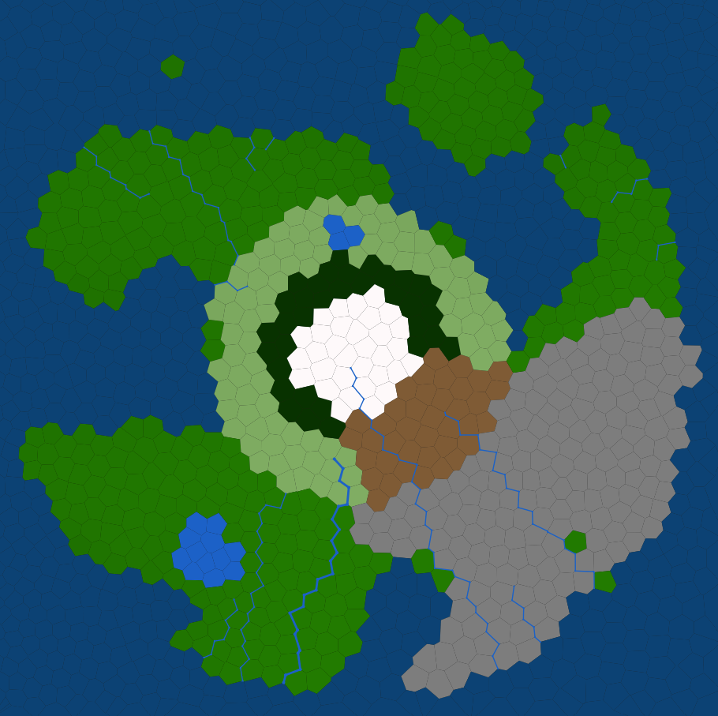
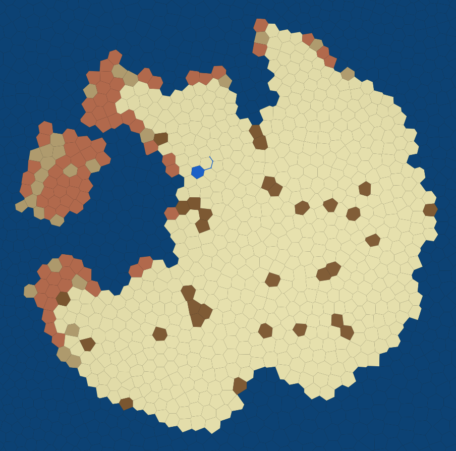
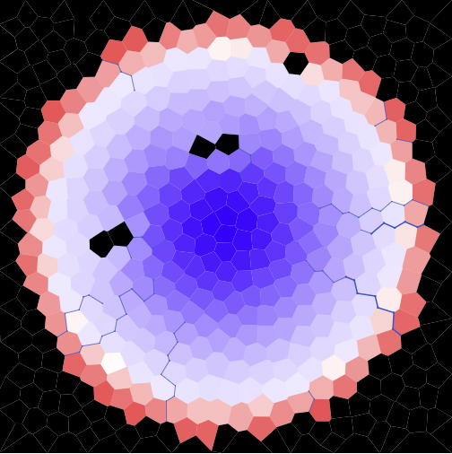

# Assignment A2: Mesh Generator
  - Mithun Paramathasan [paramatm@mcmaster.ca]
  - Nirmal Chaudhari [chaudn12@mcmaster.ca]
  - Sathurshan Arulmohan [arulmohs@mcmaster.ca]

## How to run the product
### Installation instructions
This product is handled by Maven, as a multi-module project. 

To install the different tooling on your computer, simply run:

```
mvn install
```

After installation, you'll find an application named `generator.jar` in the `generator` directory, another file name `island.jar` in the `island` directory and a file named `visualizer.jar` in the `visualizer` one. 

### Generator

To run the generator, go to the `generator` directory, and use `java -jar` to run the product. Sample.mesh is the binary file containing the mesh.

#### Grid-Based Mesh
```
cd generator 
java -jar generator.jar sample.mesh -grid [-width] [-height] [-spacing]
```
`width` and `height` default is 500px while `spacing` default is 20 and are optional to change in the command line. Note that the minimum spacing is 10. 

Example: `java -jar generator.jar sample.mesh -grid -width 400 -height 400`

#### Irregular Mesh
```
cd generator 
java -jar generator.jar sample.mesh -irregular -numPoly [-width] [-height] [-relation]
```
`numPoly` is the number of polygons to generate on the mesh.\
`width` and `height` default is 500px and are optional to change in the command line. \
`relation` default is 1 and value can be changed for any values greater than 1 to smooth the mesh.

Example: `java -jar generator.jar sample.mesh -irregular -numPoly 500 -width 600 -height 600 -relation 3`

### Island
Generates a map based on input mesh and command line arguments. 

#### Sandbox 
To run sandbox mode of the island generator, go to the `island` directory, and use `java -jar` to run the product. Use the mesh created by the generator as input mesh and enter .mesh file name to save the island generated map.  

```
cd island
java -jar island.jar -input (input.mesh) -output (output.mesh) --mode sandbox
```

Example: `java -jar island.jar -i ../generator/sample.mesh -o sandbox.mesh --mode sandbox`

#### Regular
To run the regular mode of the island generator, go to the `island` directory, and use `java -jar` to run the product. Use the mesh created by the generator as input mesh and enter .mesh file name to save the island generated map.  

```
cd island
java -jar island.jar -input (input.mesh) -output (output.mesh) --mode regular -shape {circle, rectangle, oval, irregular, random} -altitude {volcanic, cliff, hills, flat, random} -biomes {arctic, tropical, temperate, desert} [-lakes] [-rivers] -soil {dry, humid, wet} [-aquifers] [-seed]
```

Example: `java -jar island.jar -i ../generator/regular.mesh -o desert.mesh --mode regular --shape irregular --altitude hills --biomes desert --lakes 2 --rivers 2 -soil dry --aquifers 2 -seed -2116125981790618405`

`shape`: General shape of the island: {circle, rectangle, oval, irregular, random}.\
`altitude` : The altitude behaviour of the island: {volcanic, cliff, hills, flat, random}.\
`biomes`: General biome to use for the whole map: {arctic, tropical, temperate, desert}.\
`lakes`: Maximum number of lakes in the island: (positive integer).\
`rivers`: Maximum number of rivers in the island: (positive integer).\
`soil`: The soil profile to apply to the whole island: {dry, humid, wet}.\
`aquifers`: Number of aquifers to generate on the island: (positive integer).\
`seed`: Seed to use for all random variables: (long type)


#### HeatMaps

```
cd island
java -jar island.jar -input (input.mesh) -output (output.mesh) --mode heatmap -shape {circle, rectangle, oval, irregular, random} -altitude {volcanic, cliff, hills, flat, random} -biomes {arctic, tropical, temperate, desert} [-lakes] [-rivers] -soil {dry, humid, wet} [-aquifers] [-seed]
```

Example: `java -jar island.jar -i ../generator/regular.mesh -o desert.mesh --mode heatmap --shape irregular --altitude hills --biomes desert --lakes 2 --rivers 2 -soil dry --aquifers 2 -seed -2116125981790618405`


`shape`: General shape of the island: {circle, rectangle, oval, irregular, random}.\
`altitude` : The altitude behaviour of the island: {volcanic, cliff, hills, flat, random}.\
`biomes`: General biome to use for the whole map: {arctic, tropical, temperate, desert}.\
`lakes`: Maximum number of lakes in the island: (positive integer).\
`rivers`: Maximum number of rivers in the island: (positive integer).\
`soil`: The soil profile to apply to the whole island: {dry, humid, wet}.\
`aquifers`: Number of aquifers to generate on the island: (positive integer).\
`seed`: Seed to use for all random variables: (long type)

#### Urbanism
To run the Urban mode of the island generator, go to the `island` directory, and use `java -jar` to run the product. Use the mesh created by the generator as input mesh and enter .mesh file name to save the island generated map. The urban mode wil create an island with cities. The cities are connected using a star network with roads and in a non-star nework with dirt roads. 

```
cd island
java -jar island.jar -input (input.mesh) -output (output.mesh) --mode urban -shape {circle, rectangle, oval, irregular, random} -altitude {volcanic, cliff, hills, flat, random} -biomes {arctic, tropical, temperate, desert} [-lakes] [-rivers] -soil {dry, humid, wet} [-aquifers] [-seed] --cities
```

Example: `java -jar island.jar -i ../generator/regular.mesh -o desert.mesh --mode regular --shape irregular --altitude hills --biomes desert --lakes 2 --rivers 2 -soil dry --aquifers 2 -seed -2116125981790618405`

`shape`: General shape of the island: {circle, rectangle, oval, irregular, random}.\
`altitude` : The altitude behaviour of the island: {volcanic, cliff, hills, flat, random}.\
`biomes`: General biome to use for the whole map: {arctic, tropical, temperate, desert}.\
`lakes`: Maximum number of lakes in the island: (positive integer).\
`rivers`: Maximum number of rivers in the island: (positive integer).\
`soil`: The soil profile to apply to the whole island: {dry, humid, wet}.\
`aquifers`: Number of aquifers to generate on the island: (positive integer).\
`seed`: Seed to use for all random variables: (long type)
`cities`: Number of cities to generate on the island: (int type)


##### Whittaker Diagrams
The following graphs are the Whittaker diagrams used in this project. Note: These Whittaker diagrams are not accurate to real the world and are just created by our team for this project. The colors on the diagram also correspond to the colors to the generated map. Note: darker looking tiles are area where humidity levels are higher. 









##### Other Map Colors



### Visualizer

To visualize an existing mesh, go the the `visualizer` directory, and use `java -jar` to run the product. The product takes in the file containing the mesh, and the name of the file to store the visualization (as an SVG image).

```
cd visualizer 
java -jar visualizer.jar ../generator/sample.mesh sample.svg [-X]
ls -lh sample.svg
```
To viualize the SVG file:

  - Open it with a web browser
  - Convert it into something else with tool slike `rsvg-convert`

### Debug Visualizer
In debug mode, it will visualize the polygon's segments and vertices as black, centroid as red and neighbouring relations as grey. Debug mode uses the flag `-X`
 ```
 java -jar visualizer.jar ../generator/sample.mesh sample.svg -X
 ```

### Example runs
To see a examples of the mesh, run any one of the scripts below in the main directory. The mesh will be saved as ../generator/sample.mesh.

```sh Scripts/runAll```


```sh Scripts/runAllDebug```


```sh Scripts/runAllIrregular```


```sh Scripts//runAllDebugIrregular```


```sh Scripts/runSandbox```


```sh Scripts/runArcticExample```



```sh Scripts/runTropicalExample```


```sh Scripts/runTemperateExample```



```sh Scripts/runDesertExample```



```sh Scripts/runTemperateHeatmap```



```sh Scripts/runUrbanExample```


## How to contribute to the project

When you develop features and enrich the product, remember that you have first to `package` (as in `mvn package`) it so that the `jar` file is re-generated by maven.
